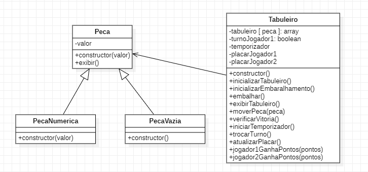
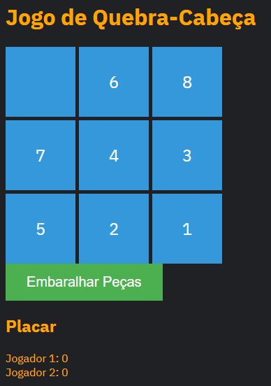

# Jogo de Quebra-Cabeça - Documentação do Projeto

## Visão Geral

Este documento fornece uma visão geral do projeto "Jogo de Quebra-Cabeça". Este é um jogo de quebra-cabeça simples em que os jogadores devem reorganizar peças numeradas para completar o quebra-cabeça. O jogo inclui funcionalidades como embaralhamento automático, temporizador de turno e um placar para acompanhar os pontos dos jogadores.

## Introdução
O "Jogo de Quebra-Cabeça" é um jogo de lógica em que os jogadores devem reorganizar peças numeradas em ordem crescente. O objetivo é completar o quebra-cabeça o mais rápido possível e ganhar pontos.

## Estrutura do Projeto
O projeto está estruturado da seguinte maneira:

. **index.html:** O arquivo HTML que contém a estrutura da página web.  
. **style.css:** Arquivo CSS que define o estilo visual do jogo.  
. **main.js:** O código JavaScript responsável pela lógica do jogo.  

## Funcionalidades
### Embaralhamento de Peças
O jogo permite que os jogadores embaralhem as peças clicando no botão "Embaralhar Peças." Isso rearranja aleatoriamente as peças no tabuleiro.

### Regras do Jogo
. Os jogadores devem reorganizar as peças numeradas em ordem crescente, deixando o espaço em branco na última posição.  
. Clique em uma peça adjacente ao espaço em branco para movê-la para a posição vazia.  
. O jogador pode ganhar pontos resolvendo o quebra-cabeça no menor tempo possível.

### Contagem de Pontos
Os pontos são concedidos aos jogadores quando eles resolvem o quebra-cabeça. O número de pontos ganhos pode ser personalizado.

### Arquitetura do Código
O código é estruturado em classes que representam as peças, o tabuleiro e as funcionalidades do jogo. As interações e a lógica de jogo são cuidadosamente implementadas.

### Como Jogar
1. Clique em "Embaralhar Peças" para iniciar o jogo.

2. Clique nas peças numeradas adjacentes ao espaço em branco para movê-las.

3. Continue movendo as peças até que todas estejam em ordem crescente.

4. Ganhe pontos ao concluir o quebra-cabeça no menor tempo possível.

### Depuração e Solução de Problemas
Se encontrar algum problema durante o jogo, verifique o console do navegador para mensagens de erro. Certifique-se de que todos os arquivos do projeto estão no local correto.

### Créditos
Este projeto foi desenvolvido por [Seu Nome] e contou com contribuições de [Nomes dos Colaboradores]. Agradecemos à comunidade de código aberto por recursos e inspiração.

### Diagrama de Classes

### Layout

