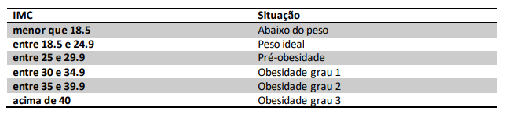

Aula 01

# Algoritmos

---

## Definição

- **MATEMÁTICA** - sequência finita de regras, raciocínios ou operações que, aplicada a um número finito de dados, permite solucionar classes semelhantes de problemas.

- **INFORMÁTICA** - conjunto das regras e procedimentos lógicos 'perfeitamente' definidos que levam à solução de um problema em um número finito de etapas.

---

## Estudo de caso

Farmácia do sr. Joaquim (Cálculo de IMC)

Fórmula para obtenção do IMC

`imc = peso/altura²`

Tabela com as faixas de IMC



Vamos construir um algoritmo para facilitar a vida do sr Joaquim!

---

Aula 01

# Sistemas de tipos

&nbsp;

> JavaScript é uma linguagem dinâmica com tipos dinâmicos.

&nbsp;

Dizemos que, no JavaScript, a tipagem é dinâmica e fraca.

---

### Tipagem dinâmica

Qualquer variável pode receber e reatribuir valores de todos os tipos.

```js
let student = "André"; // student é uma string
student = 25; // student agora é um número
student = true; // student agora é um booleano
```

&nbsp;

---

### Tipagem fraca

Permite a conversão implícita de tipo quando a operação envolve tipos incompatíveis.

```js
let num = 18; // num é um número
let result = num + "2"; // o JavaScript coage num para string, que pode, então, ser concatenada com o "2"
console.log(result); // 182
```

---

## Tipos em JavaScript

Em JavaScript, os tipos são subdivididos em _Tipos primitivos_ e _objetos_.

---

### Tipos primitivos

Um primitivo é um dado que não é representado através de um objeto. São eles: `String`, `Number`, `BigInt`, `Boolean`, `Undefined`, `Null` e `Symbol`.

---

### String

`String` é uma sequência de caracteres usados para representar texto.

```js
let student = "João Santos";
console.log(typeof student); // string
```

---

### Number

No JavaScript, `Number` é um tipo de dado numérico. Ao passo que em outras linguagens podem existir outros tipos para numéricos, em JavaScript usamos o `Number`.

```js
let age = 25;
console.log(typeof age); // number

let weight = 92.58;
console.log(typeof weight); // number
```

---

### BigInt

Embora não seja estritamente igual ao `Number`, o `BigInt` permite-nos usar os mesmos operadores que usamos com o `Number`, a exemplo de `+`, `-`, `*`, etc.
Usamos `BigInt` para inteiros com precisão arbitrária, ou seja, quando precisamos trabalhar com alta precisão numérica ou com números que excedem o limite de números inteiros seguros.
Para criar um `BigInt`, adicionamos um `n` ao final de um inteiro.

```js
const lightSpeed = 300000n;
console.log(typeof lightSpeed); // bigint
```

---

### Boolean

Um booleano é um tipo de dado lógico, que pode ter apenas um de dois valores possíveis: `true` ou `false`. São usados para decisões lógicas, como veremos mais à frente em estruturas condicionais.

```js
let isActive = false;
console.log(typeof isActive); // boolean
```

---

### Undefined

Tipo primitivo automaticamente atribuído para variáveis que foram recentemente declaradas e não receberam valores.

```js
let pet;
console.log(pet); // undefined
console.log(typeof pet); // undefined
pet = "Spike";
console.log(pet); // Spike
console.log(typeof pet); // string
```

---

### Null

`Null` é um literal em JavaScript, que representa um valor nulo ou "vazio", inexistente.

```js
let lastName = null;
console.log(typeof lastName); // null?
```

---

### Symbol

O tipo de dados "symbol" é qualificado como um primitivo, onde valores desse tipo podem ser usados para fazer propriedades de objetos anônimos. Ele pode ser usado como chave de uma propriedade de objeto quando este tem a intenção de ser privada, para uso interno da classe ou do tipo do objeto em questão.

```js
const s1 = Symbol("foo");
const s2 = Symbol("foo");
console.log(typeof s1); // symbol
console.log(typeof s2); // symbol
console.log(s1 === s2); // false
console.log(s1); // Symbol(foo)
console.log(s2); // Symbol(foo)
```

---

## Links úteis

- [O que é algoritmo e como ele é utilizado na internet?](https://olhardigital.com.br/2022/07/05/internet-e-redes-sociais/o-que-e-algoritmo/)

- [Saiba como funciona um algoritmo e conheça os principais exemplos existentes no mercado](https://rockcontent.com/br/blog/algoritmo/)

- [Estrutura de dados do Javascript](https://developer.mozilla.org/pt-BR/docs/Web/JavaScript/Data_structures)

- [Tipos primitivos](https://developer.mozilla.org/pt-BR/docs/Glossary/Primitive)

- [Operador Typeof](https://developer.mozilla.org/pt-BR/docs/Web/JavaScript/Reference/Operators/typeof)

- [A história do “typeof null”](https://2ality.com/2013/10/typeof-null.html)

- [Symbol](https://developer.mozilla.org/pt-BR/docs/conflicting/Web/JavaScript/Reference/Global_Objects/Symbol)

- [JavaScript Symbols: But Why?](https://medium.com/intrinsic-blog/javascript-symbols-but-why-6b02768f4a5c)
